# VentasFix — Backoffice y API

## 1. Datos

| Campo | Dato |
|-------|------|
| **Estudiante** | Luis Hernandez |
| **Asignatura** | Desarrollo de software web I |
| **Evaluación** | Examen transversal |
| **Repositorio** | https://github.com/LuisHC32/Examen |

---

## 2. Levantar

```bash
docker compose up --build
```

- App: http://localhost:3000
- Seed: `admin@ventasfix.cl` / `Admin123!`

---

## 3. Stack

| Capa | Tecnología |
|------|------------|
| **Front** | Vite + React 19 + TypeScript + React Router (`web/`) — páginas en `web/src/pages`, componentes en `web/src/components` |
| **API** | Express 5 + TypeScript (`api/`) — rutas en `api/src/routes/**` |
| **Datos** | Prisma (ORM) + PostgreSQL 16 |
| **Auth** | JWT (`jose`) — cookie httpOnly `ventasfix_token` y/o `Authorization: Bearer <token>` |
| **Seguridad** | Password con **Argon2id** (`passwordHash` en BD) |
| **Validación** | **Zod** → errores `400` `{ "error": "Validación", "details": { ... } }` |
| **UI** | Tailwind CSS 4 + toasts con **sonner** |
| **Despliegue** | Docker Compose (`web` :3000, `api` :3001, `db`) |

Front y API van separados: el backoffice (Vite) consume la API (Express) vía `web/src/lib/api-client.ts`.

---

## 4. Motivo de elección de este stack

Básicamente quería probar otros lenguajes de programación, el año pasado utilice principalmente PHP, JavaScript, HTML, CSS y MySQL. A inicios de este año usé Laravel y Tailwind, y durante este trimestre he trabajado con el stack que desarrolle este examen. (Vite + React + TypeScript (front y back), Express + Prisma + PostgreSQL y Docker para el despliegue.)

## 5. Variables de entorno

Copia `.env.example` si necesitas valores locales. En Docker Compose ya van definidas:

| Variable | Uso |
|----------|-----|
| `DATABASE_URL` | PostgreSQL 16 |
| `JWT_SECRET` | Firma JWT (≥ 32 caracteres) |
| `NODE_ENV` | `development` / `production` |
| `COOKIE_SECURE` | `true` solo en HTTPS |
| `UPLOADS_DIR` | Carpeta de imágenes (en Docker: `/app/uploads`) |

---

## 6. API

### 6.1 Autenticación

### `POST /api/auth/login` → `200`

```bash
curl -s -X POST http://localhost:3000/api/auth/login \
  -H "Content-Type: application/json" \
  -d '{"email":"admin@ventasfix.cl","password":"Admin123!"}'
```

**Respuesta exitosa (`200`):**

```json
{ "token": "<jwt>" }
```

- Credenciales incorrectas → rechazo (401 en API).

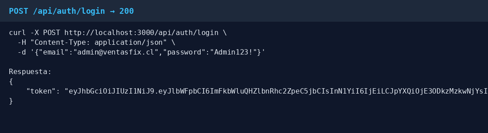

### `POST /api/auth/logout` → `200`

Invalida la sesión de cookie.

---

### 6.2 Códigos HTTP

| Caso | Código | Body |
|------|--------|------|
| `POST` crear (usuarios, productos, clientes) | **201** | Recurso creado (JSON) |
| `GET` listar / obtener por ID, `PUT` actualizar, login/logout OK | **200** | JSON |
| `DELETE` eliminar | **204** | Sin cuerpo |
| Validación (Zod, campos vacíos, RUT DV, imagen, etc.) | **400** | `{ "error": "Validación", "details": { ... } }` |
| No autenticado, token inválido/expirado, credenciales incorrectas | **401** | `{ "error": "…" }` |
| Recurso inexistente | **404** | `{ "error": "…" }` |
| Conflicto (email, RUT, SKU o RUT empresa duplicado) | **409** | `{ "error": "…" }` |

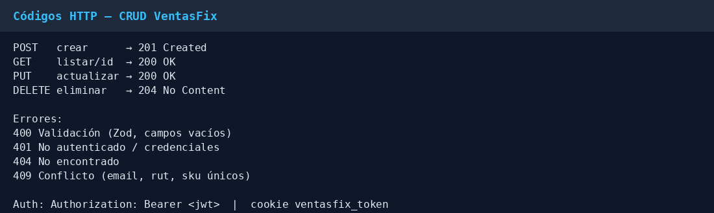

Helpers en `lib/http.ts`: `jsonOk`, `jsonCreated`, `jsonNoContent`, `jsonError`, `jsonValidation`.

---

### 6.3 Dashboard — `/api/dashboard`

### `GET /api/dashboard` → `200`

```bash
curl -s http://localhost:3000/api/dashboard \
  -H "Authorization: Bearer $TOKEN"
```

**Ejemplo de respuesta:**

```json
{ "users": 3, "products": 10, "clients": 5 }
```

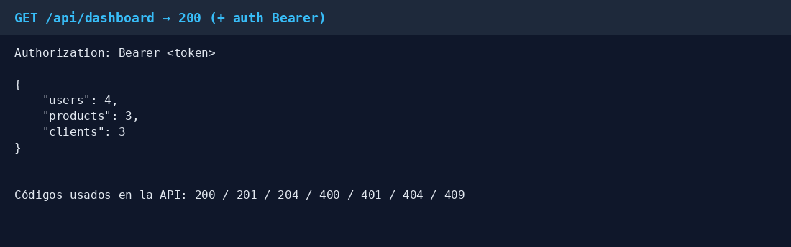

---

### 6.4 Usuarios — `/api/users`

Modelo: `id`, `rut`, `nombre`, `apellido`, `email` (`@ventasfix.cl`), `password` → se guarda como `passwordHash`.

### `GET /api/users` → `200`

Lista todos los usuarios (sin exponer el hash).

```bash
curl -s http://localhost:3000/api/users \
  -H "Authorization: Bearer $TOKEN"
```

### `GET /api/users/:id` → `200` | `404`

```bash
curl -s http://localhost:3000/api/users/1 \
  -H "Authorization: Bearer $TOKEN"
```

### `POST /api/users` → `201` | `400` | `409`

Crea usuario y **cifra la password** con Argon2id.

```bash
curl -s -X POST http://localhost:3000/api/users \
  -H "Authorization: Bearer $TOKEN" \
  -H "Content-Type: application/json" \
  -d '{
    "rut": "12.345.678-5",
    "nombre": "Ana",
    "apellido": "Pérez",
    "email": "ana.perez@ventasfix.cl",
    "password": "ClaveSegura1!"
  }'
```

### `PUT /api/users/:id` → `200` | `400` | `404` | `409`

```bash
curl -s -X PUT http://localhost:3000/api/users/1 \
  -H "Authorization: Bearer $TOKEN" \
  -H "Content-Type: application/json" \
  -d '{
    "rut": "12.345.678-5",
    "nombre": "Ana",
    "apellido": "Pérez",
    "email": "ana.perez@ventasfix.cl"
  }'
```

(Password opcional en update; si se envía, se vuelve a hashear.)

### `DELETE /api/users/:id` → `204` | `404`

```bash
curl -s -o /dev/null -w "%{http_code}\n" -X DELETE \
  http://localhost:3000/api/users/2 \
  -H "Authorization: Bearer $TOKEN"
```
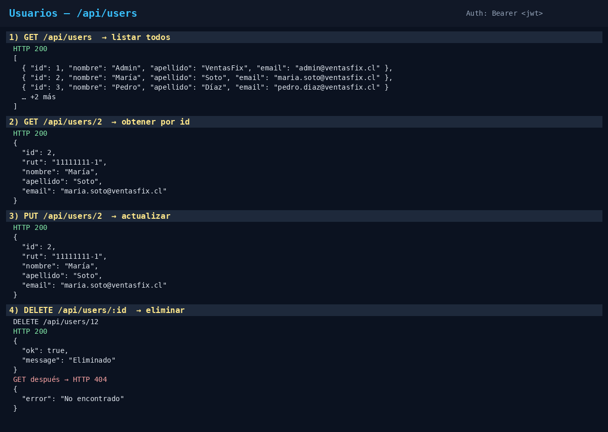

---

### 6.5 Productos — `/api/products`

Modelo: `sku`, `nombre`, `descripcionCorta`, `descripcionLarga`, `imagen`, `precioNeto`, `precioVenta` (IVA 19%), `stockActual`, `stockMinimo`, `stockBajo`, `stockAlto`.

Alta/edición con imagen: **`multipart/form-data`** (campo archivo `imagen`). El archivo queda en `public/uploads`; en BD solo la ruta.

### `GET /api/products` → `200`

```bash
curl -s http://localhost:3000/api/products \
  -H "Authorization: Bearer $TOKEN"
```

### `GET /api/products/:id` → `200` | `404`

```bash
curl -s http://localhost:3000/api/products/2 \
  -H "Authorization: Bearer $TOKEN"
```

### `POST /api/products` → `201` | `400` | `409`

```bash
curl -s -X POST http://localhost:3000/api/products \
  -H "Authorization: Bearer $TOKEN" \
  -F "sku=SKU-001" \
  -F "nombre=Producto demo" \
  -F "descripcionCorta=Corta" \
  -F "descripcionLarga=Descripción larga del producto" \
  -F "precioNeto=10000" \
  -F "stockActual=50" \
  -F "stockMinimo=5" \
  -F "stockBajo=10" \
  -F "stockAlto=100" \
  -F "imagen=@./producto.jpg"
```

### `PUT /api/products/:id` → `200` | `400` | `404` | `409`

Cuerpo completo (`multipart/form-data`). La imagen es opcional; si no se envía, se mantiene la actual.

```bash
curl -s -X PUT http://localhost:3000/api/products/2 \
  -H "Authorization: Bearer $TOKEN" \
  -F "sku=NB-14-001" \
  -F "nombre=Notebook 14 pulgadas" \
  -F "descripcionCorta=Portátil para oficina" \
  -F "descripcionLarga=Notebook 14 pulgadas con 16 GB de RAM" \
  -F "precioNeto=499990" \
  -F "stockActual=12" \
  -F "stockMinimo=3" \
  -F "stockBajo=5" \
  -F "stockAlto=40"
```

### `DELETE /api/products/:id` → `204` | `404`

```bash
curl -s -o /dev/null -w "%{http_code}\n" -X DELETE \
  http://localhost:3000/api/products/2 \
  -H "Authorization: Bearer $TOKEN"
```

(Al eliminar, también se limpia la imagen asociada.)

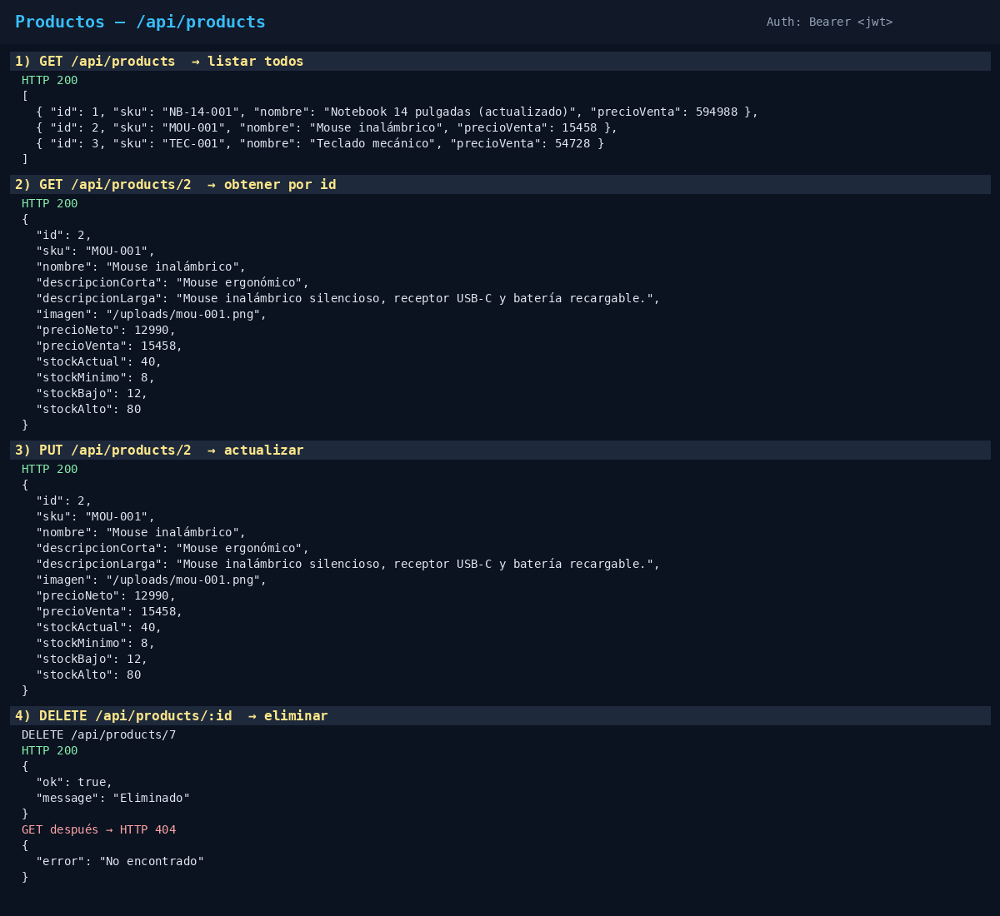

---

### 6.6 Clientes — `/api/clients`

Modelo: `rutEmpresa`, `rubro`, `razonSocial`, `telefono`, `direccion`, `nombreContacto`, `emailContacto`.

### `GET /api/clients` → `200`

```bash
curl -s http://localhost:3000/api/clients \
  -H "Authorization: Bearer $TOKEN"
```

### `GET /api/clients/:id` → `200` | `404`

```bash
curl -s http://localhost:3000/api/clients/2 \
  -H "Authorization: Bearer $TOKEN"
```

### `POST /api/clients` → `201` | `400` | `409`

```bash
curl -s -X POST http://localhost:3000/api/clients \
  -H "Authorization: Bearer $TOKEN" \
  -H "Content-Type: application/json" \
  -d '{
    "rutEmpresa": "76.123.456-0",
    "rubro": "Retail",
    "razonSocial": "Cliente Demo SpA",
    "telefono": "+56912345678",
    "direccion": "Av. Ejemplo 123, Santiago",
    "nombreContacto": "Carlos Soto",
    "emailContacto": "carlos@cliente.cl"
  }'
```

### `PUT /api/clients/:id` → `200` | `400` | `404` | `409`

```bash
curl -s -X PUT http://localhost:3000/api/clients/2 \
  -H "Authorization: Bearer $TOKEN" \
  -H "Content-Type: application/json" \
  -d '{
    "rutEmpresa": "76.123.456-0",
    "rubro": "Tecnología",
    "razonSocial": "Andes Soft SpA",
    "telefono": "+56 2 2345 1001",
    "direccion": "Av. Apoquindo 4500, Las Condes",
    "nombreContacto": "Lucía Bravo",
    "emailContacto": "compras@andessoft.cl"
  }'
```

### `DELETE /api/clients/:id` → `204` | `404`

```bash
curl -s -o /dev/null -w "%{http_code}\n" -X DELETE \
  http://localhost:3000/api/clients/2 \
  -H "Authorization: Bearer $TOKEN"
```

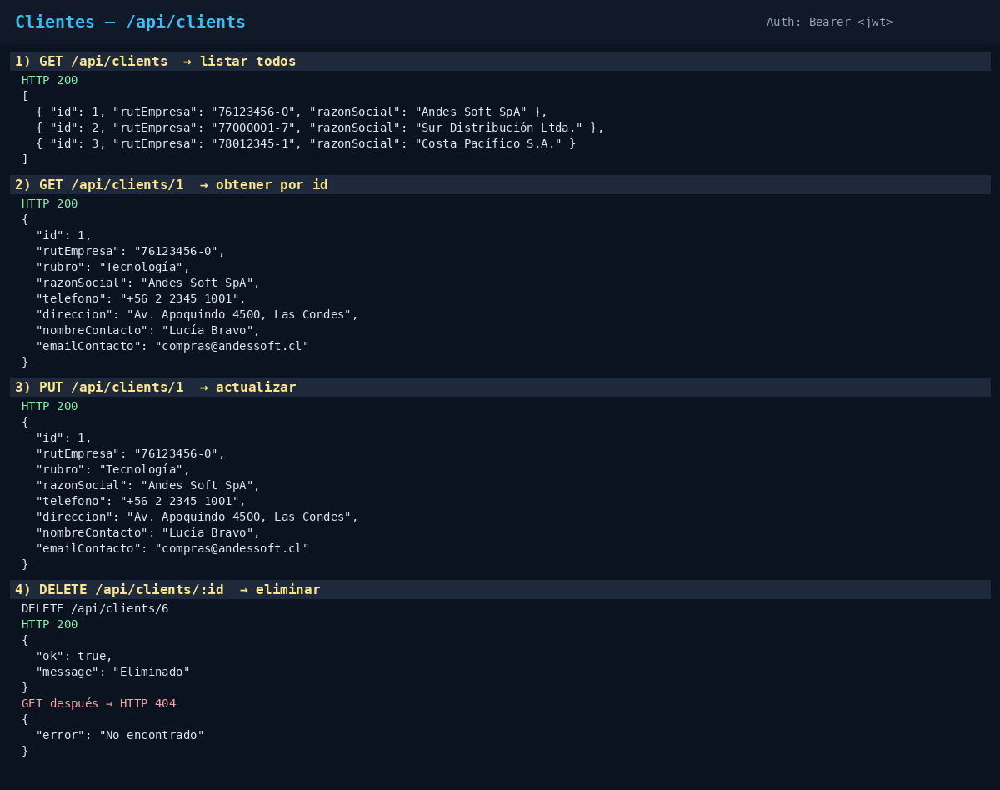

---

## 7 Mapa de controladores ↔ servicios

| Recurso | Rutas | Evidencia |
|---------|-------|-----------|
| Auth | `app/api/auth/login`, `logout` | JWT + cookie |
| Usuario | `app/api/users`, `users/[id]` | CRUD + hash password |
| Producto | `app/api/products`, `products/[id]` | CRUD + upload imagen |
| Cliente | `app/api/clients`, `clients/[id]` | CRUD |
| Dashboard | `app/api/dashboard` | Conteos |

Validadores: `lib/validators/user.ts`, `product.ts`, `client.ts`, `login.ts`.  
Auth de rutas: `lib/auth.ts` (`requireUser`) + `middleware.ts`.

---
## 8. Web

### 8.1 Login

1. Abrir http://localhost:3000/login  
2. Ingresar `admin@ventasfix.cl` / `Admin123!`  
3. Al autenticar correctamente, el sistema guarda el JWT y redirige al dashboard.  
4. Rutas del backoffice quedan protegidas por `middleware.ts` (sin sesión → login).

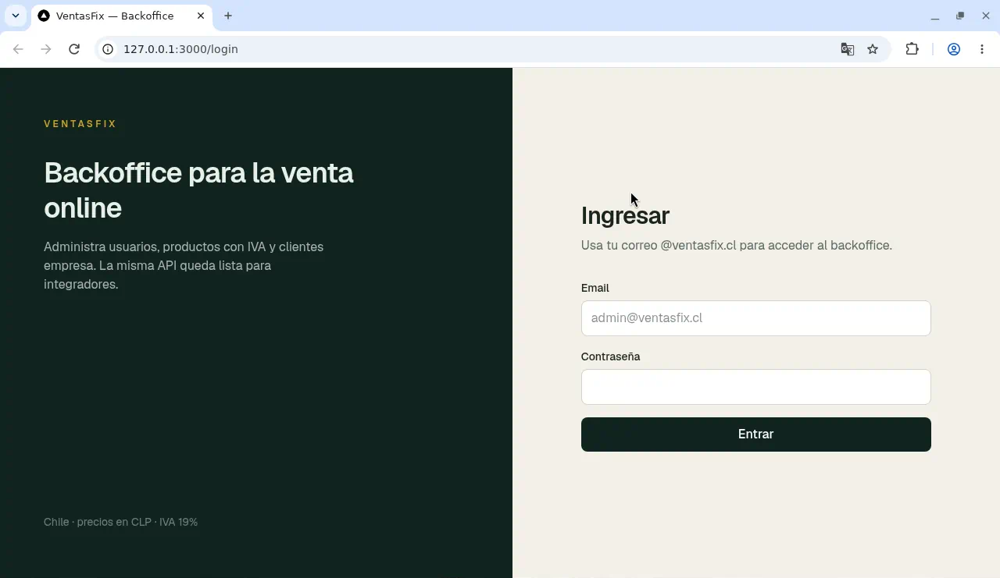

### 8.2 Dashboard

Ruta: `/`

Muestra conteos del sistema:
- Cantidad de **usuarios**
- Cantidad de **productos**
- Cantidad de **clientes**

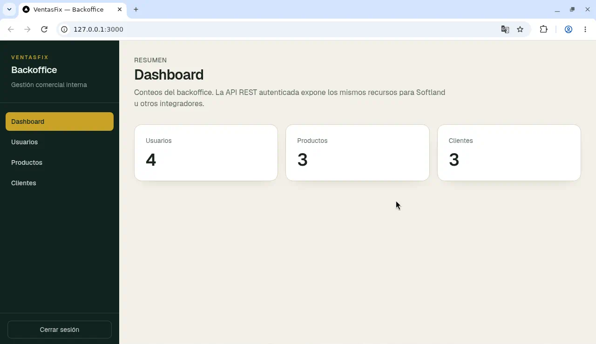

---

### 8.3 Usuarios

### Vistas
**Listar todos los usuarios `/usuarios`**
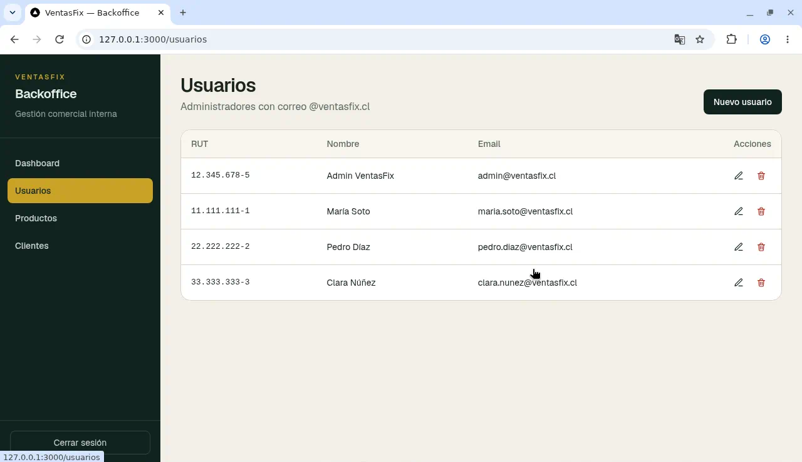  
**Crear un usuario nuevo `/usuarios/nuevo`**
 
**Ver / actualizar por id `/usuarios/[id]`**
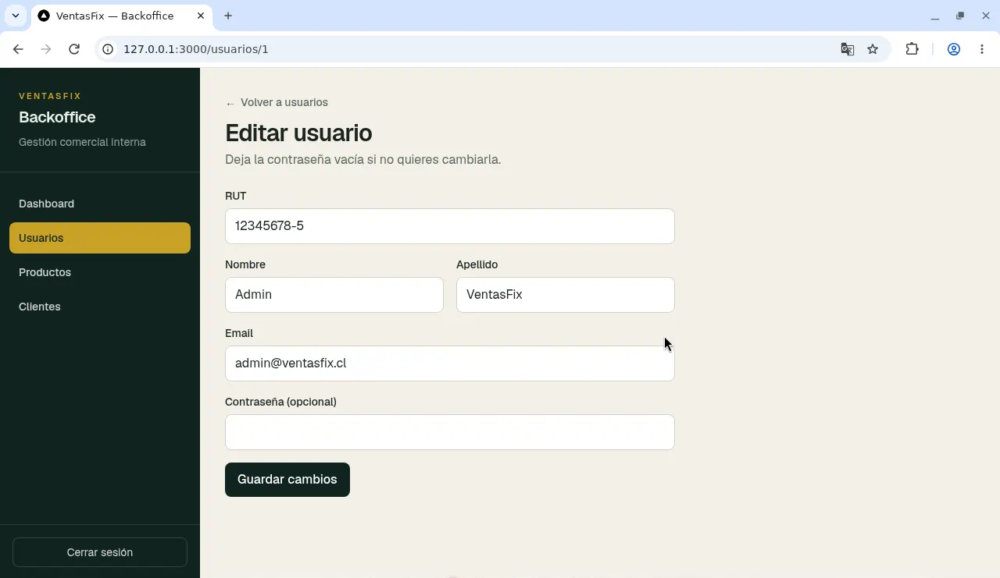

---

### 8.4 Productos

### Vistas
**Listar todos los productos `/productos`**
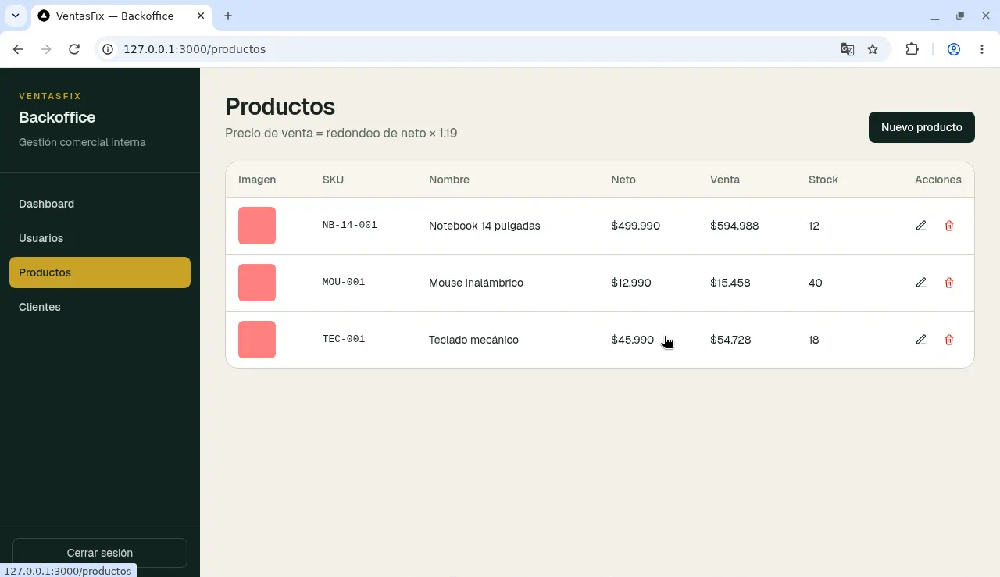  
**Crear un producto nuevo `/productos/nuevo`**
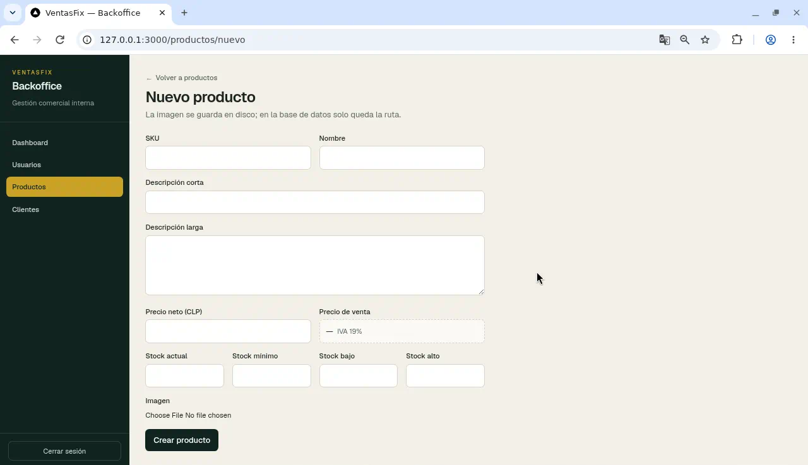
**Ver / actualizar por id `/productos/[id]`**
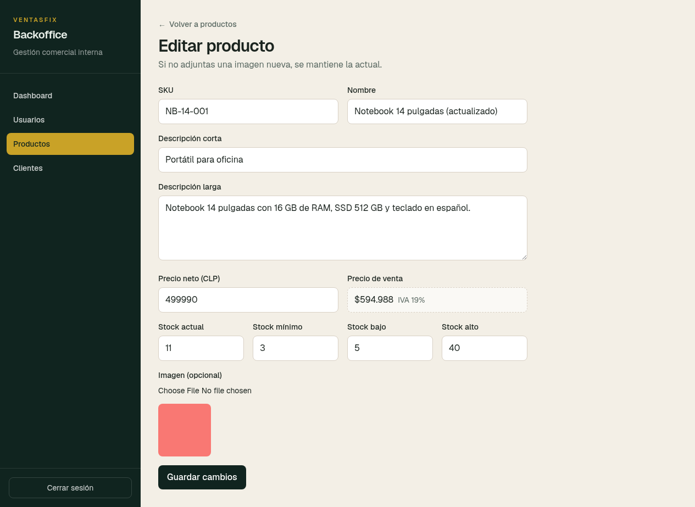

---

### 8.5 Clientes

### Vistas
**Listar todos los clientes `/clientes`**
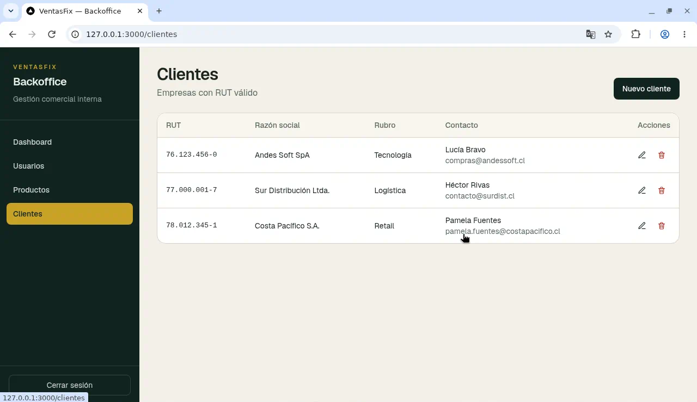  
**Crear un cliente nuevo `/clientes/nuevo`**
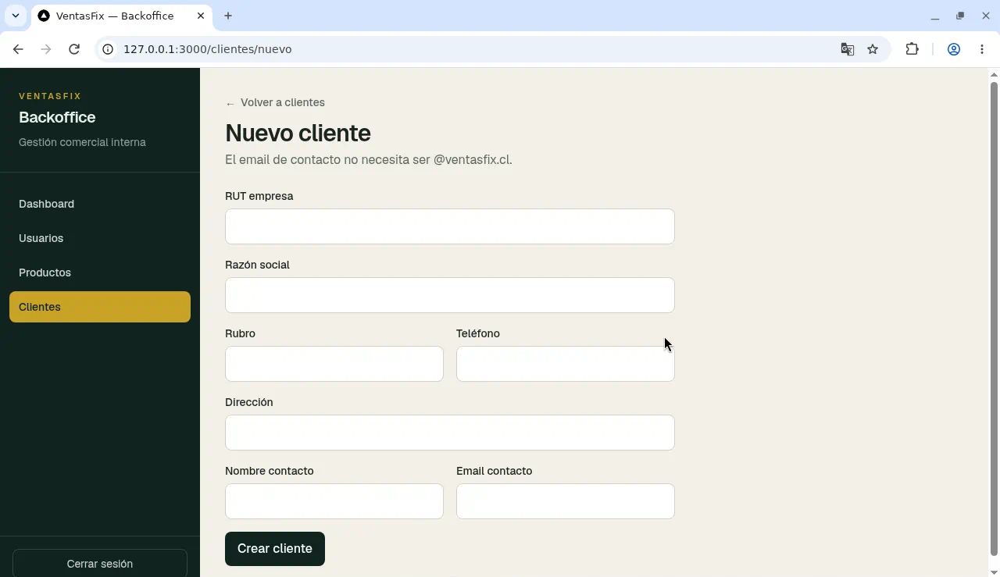
**Ver / actualizar por id `/clientes/[id]`**
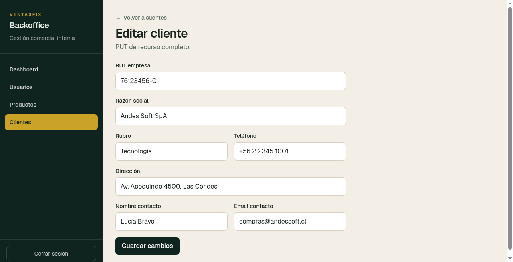

---

## 9 Componentes reutilizables

| Componente | Uso |
|------------|-----|
| `UserForm`, `ProductForm`, `ClientForm` | Altas y ediciones |
| `Sidebar` | Navegación del backoffice |
| `ConfirmButton` | Confirmación antes de eliminar |
| `BackLink` | Volver al listado |

Tambien se implementó el modal de confirmacion de eliminacion y toast de exito
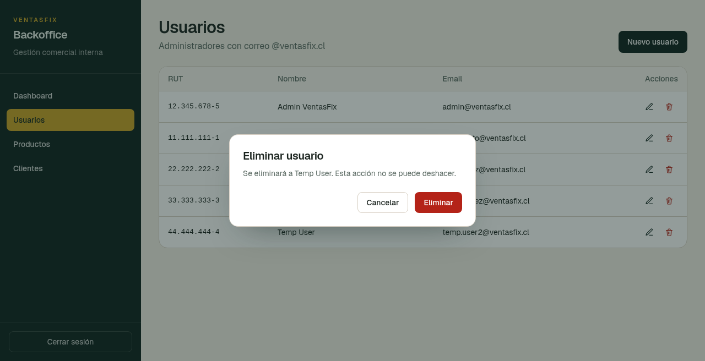
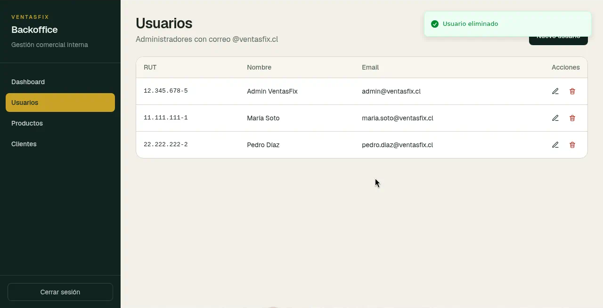

Se usa en: `usuarios`, `productos` y `clientes`.

---